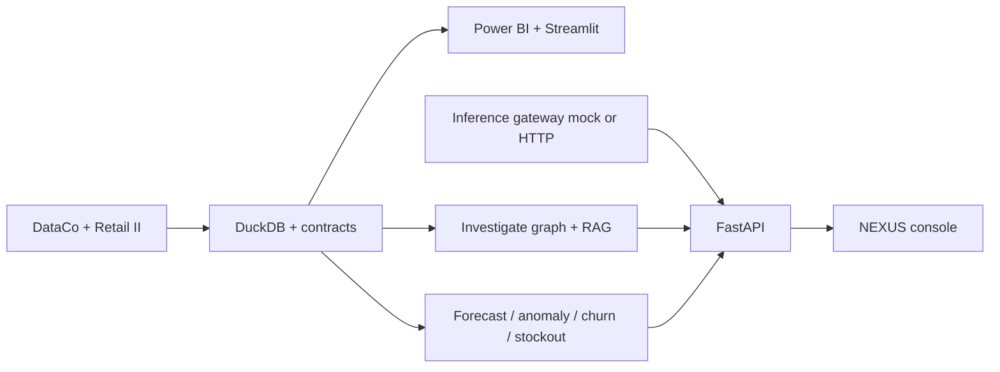

# NEXUS Decision Intelligence Platform

**One system for retail and supply-chain decision intelligence** — data engineering through inference — so an operator can ask *why revenue moved*, *why OTIF is low*, *what might stock out*, *who looks inactive*, and *what to do next*, and get **SQL, models, and SAMPLE-policy citations** instead of a chatbot shrug.

| | |
|---|---|
| **Domain** | Supply chain + retail operations |
| **Stack** | DuckDB · FastAPI · Streamlit · scikit-learn · Power BI |
| **Default LLM** | Offline **mock** (`mock` / `small` / `large` slots). Live OpenAI-compatible HTTP is opt-in. |
| **Status** | Portfolio / local-first — **not** hosted SaaS |

[](https://github.com/tnishant082-dev/nexus-decision-intelligence/actions/workflows/ci.yml)


> Formerly *Supply Chain Control Tower*. The Power BI `.pbip` layer is retained.

**Demo video:** [`artifacts/nexus-decision-intelligence-demo.mp4`](./artifacts/nexus-decision-intelligence-demo.mp4)  
Live UI captures (may lag the latest Streamlit layout): [`screenshots/nexus/`](./screenshots/nexus/)

---

## Business problem

OMS / WMS / TMS / procurement extracts usually live in separate files. NEXUS lands **public** DataCo + Online Retail II tables into DuckDB, publishes honest KPIs, trains lightweight models, and runs a multi-agent **investigate** flow.

Example questions:

- Why did revenue decline?
- Why is OTIF low?
- Which products look like stockout risk in this extract?
- Which customers match a 180-day inactivity (churn **proxy**)?
- What action should we take next?

The flagship loop is **dollarized exceptions**, not prettier tiles: rank warehouses by late-line revenue $, run linear what-ifs, emit a Monday brief, accept/reject actions. Late $ is **service-risk exposure**, not lost sales. See [`docs/business-impact.md`](./docs/business-impact.md).

---

## Architecture



Full diagrams: [`docs/architecture.md`](./docs/architecture.md) · decisions: [`docs/design-decisions.md`](./docs/design-decisions.md)

### Layer map

| Layer | Path | Local behavior |
|---|---|---|
| Data engineering | `data-engineering/` | Incremental land/clean/load, YAML contracts, profile, freshness, catalog, lineage |
| Analytics | `analytics/` + `dashboard/` | Metric dictionary + KPI views + Power BI |
| Data science | `data-science/` | Welch test, CIs, RCA, correlations, A/B calculator |
| ML | `ml/` | Forecast vs lag-1, OTIF anomaly, churn without recency, stockout proxy, file registry, PSI drift |
| RAG | `ai/rag/` | Hybrid retrieval + citations; FAISS / sentence-transformers **if installed** |
| Agents | `ai/agents/` | Analytics, SQL, forecast, inventory, risk, RAG, decision; LangGraph **if installed** |
| Inference | `inference/` | Router, cache, TTFT/token/cost logs; OpenAI/Groq/Ollama/vLLM/llama.cpp **HTTP adapters** |
| Platform | `backend/` + `frontend/` | API key + roles + `/metrics` · Streamlit tabs |
| Observability | `observability/` | Prometheus scrape example + Grafana JSON (**you** run those tools) |

---

## Datasets

| Source | Role |
|---|---|
| **DataCo Smart Supply Chain** (public extract) | Orders, shipments, inventory, OTIF/late flags |
| **Online Retail II** (UCI / public) | Customer / retail enrichment |

Window in this extract: **2015-01-01 → 2018-01-31**. See [`docs/data-scope.md`](./docs/data-scope.md).

---

## KPIs (computed from the included warehouse)

Re-run `python data-engineering/run_pipeline.py` and `SELECT * FROM v_exec_kpis` rather than treating README figures as a SLA.

Typical values on this extract (also listed in `docs/data-scope.md`):

| Area | Metrics |
|---|---|
| Finance | Revenue, profit, margin, annual growth (`v_finance_growth` — partial years) |
| Operations | OTIF, fill/in-full, perfect order |
| Inventory | Turns **proxy**, coverage ratio, stockout % (snapshot-weighted) |
| Customer | 90-day retained %, 180-day inactivity churn **proxy**, average LTV |

Definitions: [`analytics/metrics/dictionary.yaml`](./analytics/metrics/dictionary.yaml).

---

## ML models

| Model id | Task | Holdout / label honesty |
|---|---|---|
| `demand_forecast_v1` | Category × week units | Time holdout vs **lag-1 naive**; sklearn HistGB is registered even if XGBoost is compared |
| `anomaly_otif_v1` | IsolationForest on warehouse-week OTIF/late | Contamination 0.05 is a heuristic |
| `churn_v1` | Inactivity proxy | **Without recency**; with-recency AUC is leaky and not registered |
| `stockout_v1` | Product risk proxy | Label uses stockout history — ranking demo |

Train: `python -m ml.run_all`. Metrics are written under `ml/experiments/` — **no accuracy is invented in this README**.

---

## Agents and RAG

Investigate graph: orchestrator → analytics/SQL → forecast registry → inventory → risk → RAG → decision.

- Evidence: SQL snippets, model ids, document **citations**.
- `human_review=true` prefixes recommendations with a hold line.
- Knowledge files in `docs/knowledge/` are labeled **SAMPLE**.
- Retrieval eval (`python -m ai.rag.evaluate`) scores **recall/precision vs gold doc ids**. Faithfulness is not claimed (`null` until a judge).

---

## Inference

Default: mock completions on CPU with capped sleep. Labels `small`/`large` are **slots**, not GPUs.

Opt-in HTTP (OpenAI-compatible): OpenAI, Groq, Ollama, vLLM, llama.cpp server. Failed HTTP **falls back to mock**. This repo does **not** start those servers.

Gateway logs: latency, TTFT (non-streaming), tokens, cache hits, cost (0 unless you set USD rates). Streamlit **Inference Monitor** reads the local SQLite log.

---

## Monitoring

- `GET /metrics` — Prometheus text
- `observability/prometheus.yml` — example scrape
- `observability/grafana/nexus-inference.json` — import yourself
- `monitoring/inference_logs.sqlite`, `monitoring/audit.sqlite`

---

## Setup

```bash
python -m venv .venv && source .venv/bin/activate
pip install -r requirements.txt
export PYTHONPATH=.
export NEXUS_API_KEY=dev-nexus-key

python data-engineering/run_pipeline.py
python -m ml.run_all   # optional
uvicorn backend.main:app --port 8000
API_URL=http://127.0.0.1:8000 streamlit run frontend/streamlit_app.py
```

Docker: `docker compose up --build`. Details: [`docs/deployment.md`](./docs/deployment.md).

Optional extras (XGBoost, LangGraph, MiniLM, MLflow, …): `pip install -r requirements-optional.txt`.

### Investigate

```bash
curl -s -X POST http://127.0.0.1:8000/api/v1/investigate \
  -H 'Content-Type: application/json' \
  -H 'X-API-Key: dev-nexus-key' \
  -d '{"question":"Why is OTIF low and which warehouses drive late deliveries?"}'
```

---

## Console tabs

Command Center · **Decision Board** · Analytics · Predictions · AI Analyst · Knowledge · Agent Workspace · Inference Monitor · ML Experiments

Wilson 95% CIs on order-grain OTIF (network + warehouse) ship in **1.3**. The action ledger keeps accept/reject **history**, not just a request flag. Late $ is still exposure, not lost sales.

| Command Center | AI Analyst | Inference |
|:---:|:---:|:---:|
|  |  |  |

---

## Benchmark results

- Forecast MAE/RMSE/WAPE vs lag-1: see the JSON produced by `python -m ml.run_all` on **your** machine.
- Inference timings in git are **local mock sleeps**, not GPU throughput.
- RAG recall is whatever `python -m ai.rag.evaluate` prints after you run it.

This README does not paste stale numeric leaderboards.

---

## Limitations

- Historical public extracts, not a live ERP.
- Mock LLM unless you configure a provider **and** that provider is actually up.
- Inventory on-hand $ across snapshots is not a balance sheet.
- Customer names in the extract are demo PII.
- SQL keyword guard is not a database firewall.
- Screenshots may predate the latest UI.

More: [`docs/tradeoffs.md`](./docs/tradeoffs.md) · [`docs/security.md`](./docs/security.md) · [`docs/gap-analysis.md`](./docs/gap-analysis.md)

## Future

[`docs/roadmap.md`](./docs/roadmap.md)

Audit / maturity: [`docs/repository-audit.md`](./docs/repository-audit.md) · [`docs/production-readiness.md`](./docs/production-readiness.md)

---

## Author

**Nishant Tyagi** · <tnishant838@gmail.com>
