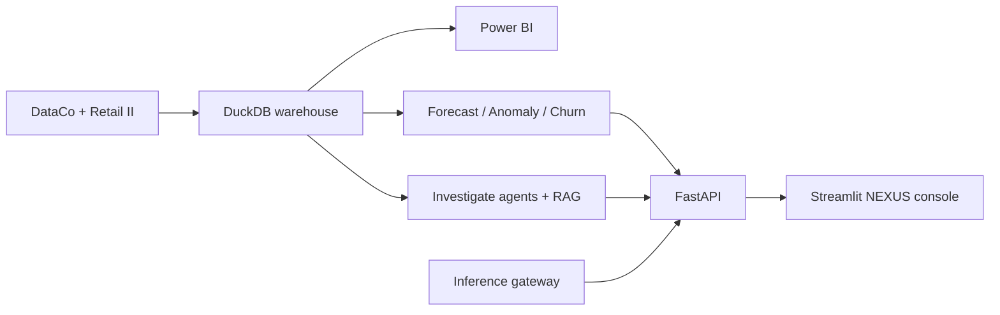
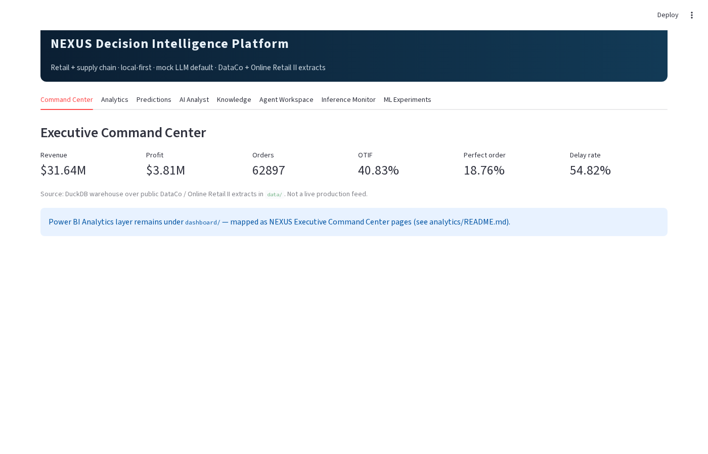
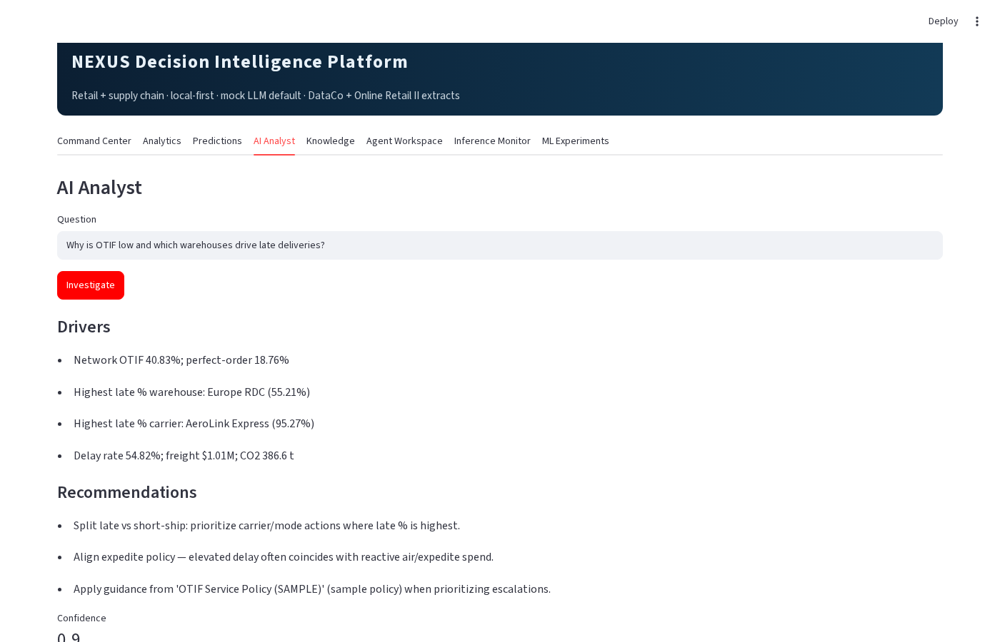
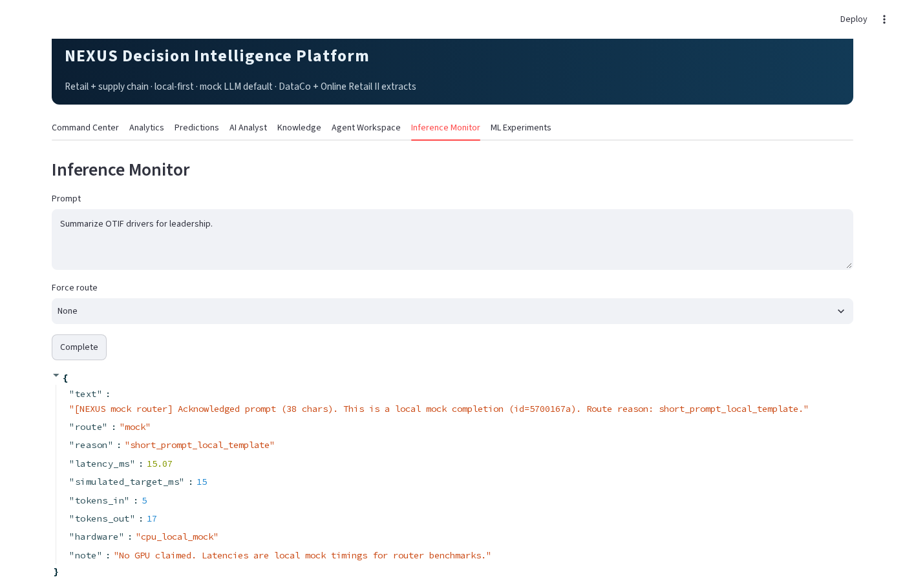
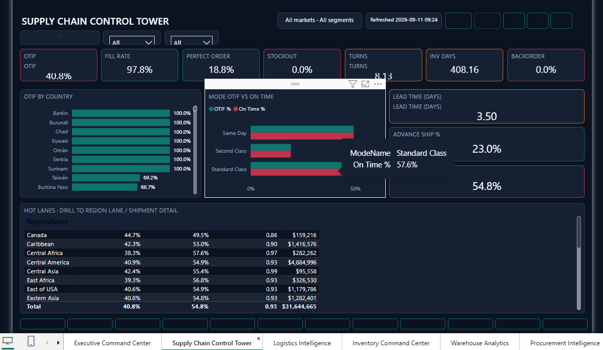

# NEXUS Decision Intelligence Platform

**Flagship local-first platform for retail + supply chain decision intelligence** — one coherent system spanning data engineering, analytics, data science, ML, AI agents/RAG, and inference routing.

| | |
|---|---|
| **Domain** | Supply chain + retail ops |
| **Stack** | DuckDB · FastAPI · Streamlit · scikit-learn · Power BI |
| **Default LLM** | Offline **mock** router (`mock` / `small` / `large` labels) |
| **Status** | Portfolio / local-first — **not** a hosted SaaS |

[](https://github.com/tnishant082-dev/nexus-decision-intelligence/actions/workflows/ci.yml)


> Formerly presented as *Supply Chain Control Tower*. The Power BI `.pbip` analytics layer is retained and mapped into the NEXUS Executive Command Center.

**Demo video (NEXUS Streamlit console ~65s, silent):** [`artifacts/nexus-decision-intelligence-demo.mp4`](./artifacts/nexus-decision-intelligence-demo.mp4)

Legacy Power BI Control Tower walkthrough (still useful for the analytics layer): [`artifacts/supply-chain-control-tower-demo.mp4`](./artifacts/supply-chain-control-tower-demo.mp4)

Live UI captures: [`screenshots/nexus/`](./screenshots/nexus/) · sample investigate JSON: [`artifacts/sample-investigate.json`](./artifacts/sample-investigate.json)

---

## Why NEXUS

Operational data usually sits in separate OMS / WMS / TMS / procurement files. NEXUS lands those public extracts into a DuckDB warehouse, exposes honest KPIs, trains lightweight models, and runs a multi-agent **investigate** flow that returns drivers, recommendations, and an evidence trail (SQL + model ids + policy citations).

## Data sources (cited)

| Source | Role in repo |
|---|---|
| **DataCo Smart Supply Chain** (public extract) | Primary orders, shipments, inventory, OTIF/late flags (`DATACO`) |
| **Online Retail II** (UCI / public) | Customer / retail enrichment (`RETAIL_UK`) |

Window in this extract: **2015-01-01 → 2018-01-31**. See [`docs/data-scope.md`](./docs/data-scope.md).

## KPIs from the included warehouse

Computed from parquet → DuckDB (not invented SaaS numbers):

| Area | Metrics |
|---|---|
| Finance | Revenue **~$31.6M** · Profit **~$3.8M** · Orders **~63K** |
| Service | OTIF **~40.8%** · Perfect order **~18.8%** · Fill/in-full **~95.7%** |
| Logistics | Freight **~$1.0M** · Delay rate **~54.8%** · CO2 **~386.6 t** |
| Procurement | PO spend **~$35.2M** · **8,340** PO lines |

## Platform map

| Layer | Path | What runs locally |
|---|---|---|
| **Data Engineering** | `data-engineering/` | Landing → clean → DuckDB, validation, lineage JSON, catalog |
| **Analytics** | `analytics/` + `dashboard/` | KPI SQL + Power BI Executive Command Center |
| **Data Science** | `data-science/` | EDA, correlations, Welch t-test (late vs on-time), segmentation |
| **ML** | `ml/` | Category/week demand forecast, OTIF anomaly, churn proxy + registry |
| **AI** | `ai/` + `docs/knowledge/` | RAG over sample SOPs, SQL tool, multi-agent investigate |
| **Inference** | `inference/` | Gateway, mock/small/large router, cache, CPU mock benchmarks |
| **Platform** | `backend/` + `frontend/` | FastAPI (API key + rate limit) · Streamlit console |



## Quick start (offline)

```bash
python -m venv .venv && source .venv/bin/activate
pip install -r requirements.txt
export PYTHONPATH=.
export NEXUS_API_KEY=dev-nexus-key

# 1) Build warehouse
python data-engineering/run_pipeline.py

# 2) Train models (optional but recommended)
python -m ml.run_all

# 3) API
uvicorn backend.main:app --port 8000

# 4) UI (other terminal)
API_URL=http://127.0.0.1:8000 streamlit run frontend/streamlit_app.py
```

Docker: `docker compose up --build`.

### Killer endpoint

```bash
curl -s -X POST http://127.0.0.1:8000/api/v1/investigate \
  -H 'Content-Type: application/json' \
  -H 'X-API-Key: dev-nexus-key' \
  -d '{"question":"Why is OTIF low and which warehouses drive late deliveries?"}' | jq
```

Returns **drivers**, **recommendations**, **evidence** (SQL snippets, model ids, doc citations), **confidence**, and an agent trail. LLM mode defaults to `mock`.

### Other curls

```bash
curl -s http://127.0.0.1:8000/health | jq
curl -s http://127.0.0.1:8000/api/v1/kpis -H 'X-API-Key: dev-nexus-key' | jq
curl -s http://127.0.0.1:8000/metrics
```

## Streamlit console tabs

Command Center · Analytics · Predictions · AI Analyst · Knowledge · Agent Workspace · Inference Monitor · ML Experiments


## NEXUS console (Streamlit)

| Command Center | AI Analyst | Inference |
|:---:|:---:|:---:|
|  |  |  |


## Power BI analytics layer

Open [`dashboard/SupplyChain-Control-Tower.pbip`](./dashboard/SupplyChain-Control-Tower.pbip). Page → NEXUS mapping: [`analytics/README.md`](./analytics/README.md).

| Executive | Control Tower | Logistics |
|:---:|:---:|:---:|
|  |  |  |

## Honesty

- No fake ₹ crore revenue or fabricated 91.7% forecast accuracy.
- Forecast metrics report MAE / RMSE / MAPE vs a **lag-1 naive** baseline on a time holdout.
- Churn AUC **with** recency is labeled leaky; registry ships the **without-recency** model.
- Inference benchmarks are **local CPU mock timings** — no GPU claims.
- Policies in `docs/knowledge/` are clearly marked **SAMPLE**.

More: [`docs/data-scope.md`](./docs/data-scope.md) · [`docs/architecture.md`](./docs/architecture.md) · [`docs/tradeoffs.md`](./docs/tradeoffs.md) · [`docs/security.md`](./docs/security.md)

## Author

**Nishant Tyagi** · <tnishant838@gmail.com>
