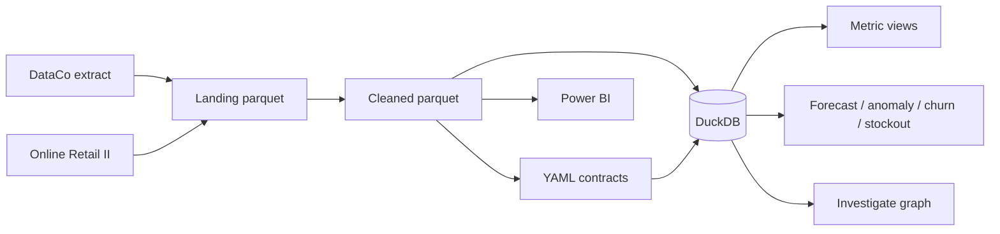

# NEXUS lineage

```mermaid
flowchart LR
  DC[DataCo extract] --> L[Landing parquet]
  UK[Online Retail II] --> L
  L --> C[Cleaned parquet]
  C --> CTR[YAML contracts]
  C --> W[(DuckDB)]
  CTR --> W
  W --> KPI[Metric views]
  W --> ML[Forecast / anomaly / churn / stockout]
  W --> AI[Investigate graph]
  C --> PBI[Power BI]
```

Generated from `lineage.json`. This is declared pipeline lineage, not query-level column lineage from a catalog product.
