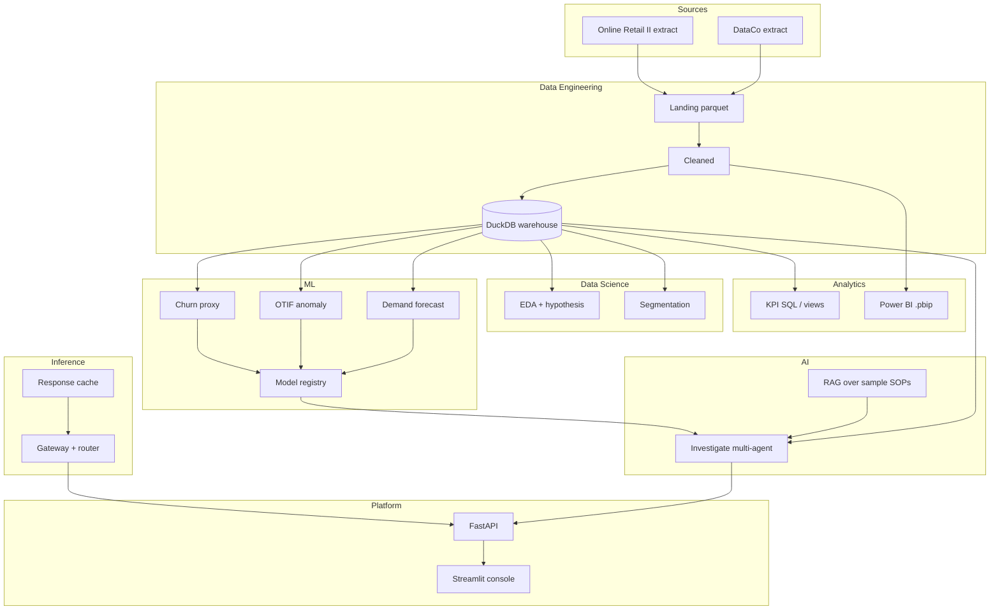

# NEXUS Architecture

## Local-first defaults
- LLM: **mock** templates via inference router (`mock` / `small` / `large` labels)
- Warehouse: DuckDB file under `data-engineering/warehouse/nexus.duckdb`
- Auth: shared API key header (`X-API-Key`)
